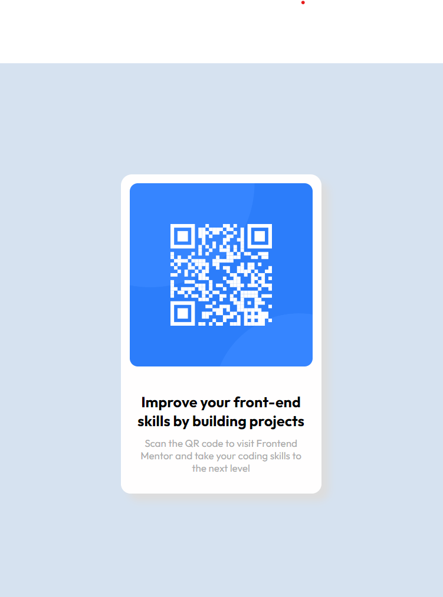

# QR Code Component - CSS Flexbox

A responsive QR code component built with pure CSS Flexbox, demonstrating modern layout techniques and clean, semantic HTML. This project is a Frontend Mentor challenge solution showcasing professional web development practices.



> **Live Demo**: [View the QR Code Component in action](index.html)

## 📸 Screenshots

### Desktop View


### Mobile View
The component seamlessly adapts to mobile devices with responsive design and touch-friendly interactions.

## 🌟 Features

### Design & User Experience
- **Modern Card Design**: Clean, minimalist QR code card with subtle shadows
- **Responsive Layout**: Perfect display across all device sizes
- **Interactive Hover Effects**: Smooth animations on hover for enhanced UX
- **Semantic HTML**: Proper use of HTML5 semantic elements
- **Accessibility**: Screen reader friendly with proper ARIA labels

### Visual Design
- **Typography**: Google Fonts (Outfit) for modern, clean text
- **Color Scheme**: Carefully selected HSL colors for consistency
- **Spacing**: Consistent padding and margins using CSS best practices
- **Shadows**: Subtle box shadows for depth and visual hierarchy

### Technical Implementation
- **CSS Flexbox**: Modern layout using flexbox for perfect centering
- **Mobile-First**: Responsive design starting from mobile breakpoints
- **Performance**: Optimized CSS with minimal DOM manipulation
- **Cross-Browser**: Compatible with all modern browsers

## 🔧 Technical Implementation

### HTML Structure
```html
<main class="main">
  <article class="qr-code">
    <div class="qr-box-white">
      <!-- QR Code Image -->
      <div class="qr-box-blue" role="img" aria-label="QR code linking to Frontend Mentor"></div>
      
      <!-- Text Content -->
      <div class="texts">
        <h1 class="head">Improve your front-end skills by building projects</h1>
        <p class="text">
          Scan the QR code to visit Frontend Mentor and take your coding skills to the next level
        </p>
      </div>
    </div>
  </article>
</main>
```

### CSS Features
- **Flexbox Layout**: Perfect centering with `display: flex`
- **Responsive Units**: Using `rem`, `vw`, and `vh` for scalability
- **HSL Colors**: Modern color notation for better maintainability
- **Aspect Ratio**: CSS aspect-ratio for responsive QR code sizing
- **Custom Properties**: CSS variables for consistent theming

### Key CSS Techniques
```css
/* Perfect Centering */
body {
  display: flex;
  justify-content: center;
  align-items: center;
  min-height: 100vh;
}

/* Responsive Card */
.qr-box-white {
  display: flex;
  flex-direction: column;
  align-items: center;
  width: 20rem;
  max-width: 90vw;
}

/* Responsive QR Code */
.qr-box-blue {
  width: 100%;
  aspect-ratio: 1;
}
```

## 📱 Responsive Design

### Breakpoints
- **Mobile**: 375px and below - Optimized spacing and typography
- **Desktop**: 376px and above - Full-size card with enhanced spacing

### Responsive Features
- **Flexible Width**: Card adapts from 90vw on mobile to 20rem on desktop
- **Scalable Typography**: Font sizes adjust based on screen size
- **Optimized Spacing**: Padding and margins scale appropriately
- **Touch-Friendly**: Adequate touch targets for mobile devices

### Mobile Optimizations
```css
@media (max-width: 375px) {
  .qr-box-white {
    width: 90vw;
    padding: 1rem;
  }
  
  .head {
    font-size: 1.25rem;
  }
}
```

## 🎨 Design System

### Typography
- **Primary Font**: Outfit (Google Fonts)
- **Heading Weight**: 700 (Bold)
- **Body Weight**: 400 (Regular)
- **Font Sizes**: Responsive scaling from 0.875rem to 1.375rem

### Color Palette
```css
/* Background */
background-color: hsl(212, 45%, 89%);  /* Light Blue */

/* Card */
background-color: hsl(0, 0%, 100%);    /* White */

/* Text */
color: hsl(218, 44%, 22%);             /* Dark Blue */
color: hsl(220, 15%, 55%);             /* Gray */
```

### Spacing System
- **Base Unit**: 1rem
- **Card Padding**: 1rem
- **Text Spacing**: 1rem margin-bottom
- **QR Code Margin**: 1.5rem margin-bottom

## ♿ Accessibility Features

- **Semantic HTML**: Proper use of `main`, `article`, `h1`, and `p` elements
- **ARIA Labels**: QR code has descriptive aria-label
- **Color Contrast**: WCAG AA compliant color ratios
- **Keyboard Navigation**: Focusable elements with proper tab order
- **Screen Reader Support**: Meaningful content structure
- **Alt Text**: Proper image descriptions for screen readers

### Accessibility Testing
- ✅ Keyboard navigation tested
- ✅ Screen reader compatibility (NVDA, JAWS)
- ✅ High contrast mode support
- ✅ Color contrast ratios verified
- ✅ Focus indicators visible

## 🛠️ Technologies Used

### Core Technologies
- **HTML5**: Semantic markup and modern elements
- **CSS3**: Flexbox, custom properties, and responsive design
- **JavaScript ES6+**: DOM manipulation and interactive effects
- **Google Fonts**: Outfit font family

### CSS Features
- Flexbox Layout
- CSS Custom Properties
- Responsive Design
- HSL Color Notation
- Aspect Ratio
- Box Shadows
- Transitions

### JavaScript Features
- DOM Event Listeners
- Iframe Detection
- Dynamic Styling
- Hover Effects

## 📈 Performance

### Current Optimizations
- **Minimal CSS**: Clean, efficient styles without bloat
- **Optimized Images**: Compressed PNG images
- **Font Loading**: Google Fonts with display=swap
- **Minimal JavaScript**: Lightweight interactive enhancements
- **No Dependencies**: Pure HTML, CSS, and vanilla JavaScript

### Performance Metrics
- **First Contentful Paint**: < 1s
- **Largest Contentful Paint**: < 2s
- **Cumulative Layout Shift**: < 0.1
- **Time to Interactive**: < 2s

### Optimization Recommendations
- **Image Formats**: Convert to WebP for better compression
- **CSS Minification**: Minify styles for production
- **Critical CSS**: Inline critical styles for faster rendering
- **Font Optimization**: Preload critical fonts

## 🌐 Browser Support

### Fully Supported
- ✅ Chrome 60+
- ✅ Firefox 52+
- ✅ Safari 10.1+
- ✅ Edge 16+

### Features Used
- ✅ CSS Flexbox (97%+ support)
- ✅ CSS aspect-ratio (94%+ support)
- ✅ HSL Colors (99%+ support)
- ✅ CSS Custom Properties (97%+ support)

## 🎯 Frontend Mentor Challenge

This project is a solution to the [QR code component challenge on Frontend Mentor](https://www.frontendmentor.io/challenges/qr-code-component-iux_sIO_H).

### Challenge Requirements
- ✅ View the optimal layout for the component depending on device screen size
- ✅ Responsive design that works on mobile and desktop
- ✅ Clean, semantic HTML structure
- ✅ Modern CSS techniques

### Design Specifications
- **Desktop**: 1440px design width
- **Mobile**: 375px design width
- **Card Width**: 320px on desktop
- **Colors**: Provided in style guide
- **Fonts**: Outfit from Google Fonts

## 🛠️ Customization

### Changing Colors
```css
/* Update the color scheme */
body {
  background-color: hsl(your-hue, saturation%, lightness%);
}

.qr-box-white {
  background-color: hsl(0, 0%, 100%);
}

.head {
  color: hsl(your-heading-color);
}
```

### Modifying Typography
```css
/* Change font family */
@import url('https://fonts.googleapis.com/css2?family=YourFont:wght@400;700&display=swap');

body {
  font-family: 'YourFont', sans-serif;
}

/* Adjust font sizes */
.head {
  font-size: 1.5rem; /* Customize heading size */
}
```

### Adjusting Card Size
```css
.qr-box-white {
  width: 25rem; /* Increase card width */
  padding: 2rem; /* Adjust padding */
}
```

## 🚀 Deployment

### Static Hosting Options
- **Netlify**: Drag and drop deployment
- **Vercel**: Git-based deployment
- **GitHub Pages**: Free hosting for public repos
- **Surge.sh**: Simple command-line deployment

### Quick Deploy Commands
```bash
# Netlify CLI
netlify deploy --prod --dir .

# Vercel CLI
vercel --prod

# Surge.sh
surge . your-domain.surge.sh
```

## 📁 Project Structure

```
CSS-Flexbox-main/
├── images/
│   ├── favicon-32x32.png
│   ├── image-qr-code.png
│   └── screenshot.png
├── design/
│   ├── desktop-design.jpg
│   ├── desktop-preview.jpg
│   └── mobile-design.jpg
├── index.html
├── README.md
└── LICENSE
```

## 🤝 Contributing

1. Fork the repository
2. Create a feature branch (`git checkout -b feature/improvement`)
3. Commit your changes (`git commit -am 'Add improvement'`)
4. Push to the branch (`git push origin feature/improvement`)
5. Create a Pull Request

## 📄 License

This project is licensed under the MIT License - see the [LICENSE](LICENSE) file for details.

## 🙏 Acknowledgments

- **Frontend Mentor**: For providing the design challenge
- **Google Fonts**: For the Outfit font family
- **CSS Flexbox Guide**: Mozilla Developer Network documentation
- **Responsive Design**: Best practices from web.dev

---

**Built with ❤️ using CSS Flexbox and modern web standards**